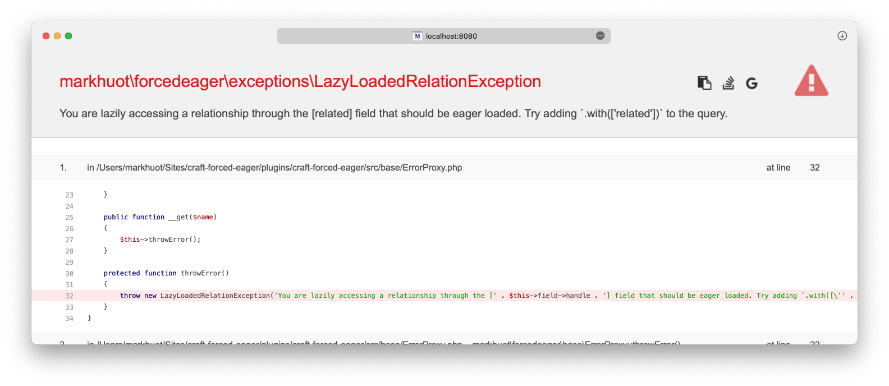

# Forced Eager Loading

A Yii2 Extension that will throw errors whenever a relationship field is accessed lazily.

Scrolling down the stack trace should show you the exact line of Twig code that prompted the error.

You can prevent exceptions in one of two ways,

1. Use the `.with(['fieldHandle'])` syntax to eager load the field (preferred)
2. Silence the error with `.allowLazyRelations()` on the query, e.g., `craft.entries.allowLazyRelations().limit(10)`.
